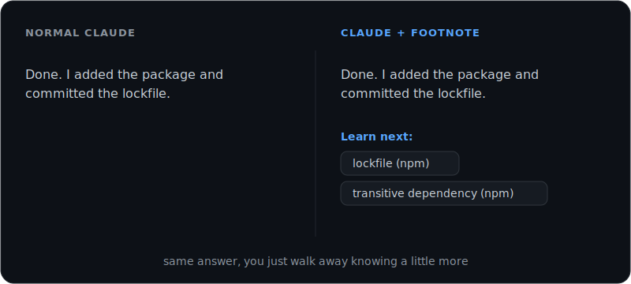

<p align="center">
  
</p>

<h1 align="center">footnote</h1>

<p align="center">
  <strong>the more you know</strong>
</p>

<p align="center">
  <a href="LICENSE"></a>
  <a href="#install"></a>
  <a href="#how-it-works"></a>
</p>

<p align="center">
  <a href="#beforeafter">Before/After</a> &nbsp;•&nbsp;
  <a href="#install">Install</a> &nbsp;•&nbsp;
  <a href="#how-it-works">How it works</a> &nbsp;•&nbsp;
  <a href="#make-it-yours">Make it yours</a>
</p>

---

A [Claude Code](https://docs.anthropic.com/en/docs/claude-code) plugin that teaches you while you code.

When Claude answers and reaches for a word a beginner wouldn't know yet (a tool, a command, some bit of jargon), it leaves a small footnote at the bottom pointing you to it. No definitions, just the term and a hint about where it lives, so you can look it up when you feel like it. Do that for a few weeks and the stuff that used to read like magic starts to make sense.

It also keeps a quiet log of what it has already shown you, so it stops repeating things you know and the hints get sharper over time.

> "You miss 100% of the words you don't look up."
>
> *Wayne Gretzky*
>
> *Michael Scott*

## Before/After

<p align="center">
  
</p>

<table>
<tr>
<td width="50%">

### Normal Claude

> Done. I added the package and committed the lockfile.

</td>
<td width="50%">

### Claude with footnote

> Done. I added the package and committed the lockfile.
>
> Learn next: `lockfile (npm)`, `transitive dependency (npm)`

</td>
</tr>
<tr>
<td>

### Normal Claude

> Fixed it. The function was changing the array in place, so I made it return a new one instead.

</td>
<td>

### Claude with footnote

> Fixed it. The function was changing the array in place, so I made it return a new one instead.
>
> Learn next: `mutation (js)`, `pure function (fp)`

</td>
</tr>
</table>

**Same answer. You just walk away knowing a little more than you did.**

## What you get

| | |
| --- | --- |
| **Footnotes that know when to shut up** | A `Learn next` line shows up only when a reply genuinely uses a word you might not know. No spam, no lectures, capped at two. |
| **A memory** | Terms move from *Seen once* to *Learned* as they come up again in real work. Once you've met something enough, footnote stops pointing it out. |
| **It's yours, and it's private** | Your log lives on your own machine at `~/.claude/footnote/learning-log.md`. No network calls. No analytics. Nothing leaves your computer. |
| **Mute whenever** | Type `footnote off` to pause it, `footnote on` to bring it back. |
| **Runs anywhere** | The hooks are plain Node, so they behave the same on Windows, macOS, and Linux. |

## Install

Inside Claude Code, run two commands:

```text
/plugin marketplace add tristanmuzzu/footnote
/plugin install footnote@footnote
```

Or from your terminal:

```bash
claude plugin marketplace add tristanmuzzu/footnote
claude plugin install footnote@footnote
```

Open a fresh session and it's on. You'll need Node on your `PATH`, which you almost certainly already have if you're running Claude Code.

## How it works

No mystery here. Claude Code lets a plugin run a small script when a session starts. footnote's script does three quiet things:

1. Makes sure your learning log exists, creating it the first time.
2. Hands Claude the rules for a good footnote: a term plus a search hint, two at most, and only when something is genuinely new.
3. Shows Claude your current log so it knows what you've already seen and already learned.

All of it happens on your machine. The script makes zero network calls and collects nothing about you. It's about 120 lines and you can read every one in [`hooks/footnote-activate.js`](hooks/footnote-activate.js).

## Your learning log

It's just a Markdown file at `~/.claude/footnote/learning-log.md`:

```markdown
## Seen once
- lockfile (npm) · 2026-06-16
- hoisting (js) · 2026-06-16

## Learned
- worktree (git) · 2026-06-16
```

Read it, edit it, back it up, or delete it. footnote rebuilds it next session if it's gone.

## Make it yours

footnote is MIT licensed and built to be forked. The behavior lives in two small, readable files:

- [`hooks/footnote-activate.js`](hooks/footnote-activate.js) sends Claude the rules each session.
- [`skills/footnote/SKILL.md`](skills/footnote/SKILL.md) spells the behavior out in plain language.

Want hints tuned for data science instead of web dev? A different log format? A weekly recap? Change those two files, push your fork, and point your own `claude plugin marketplace add <you>/footnote` at it. The layout is in [CONTRIBUTING](CONTRIBUTING.md).

## Star it

If footnote teaches you something you're glad to know, a star helps other people find it. ⭐

## License

MIT. Take it, fork it, make it yours.
